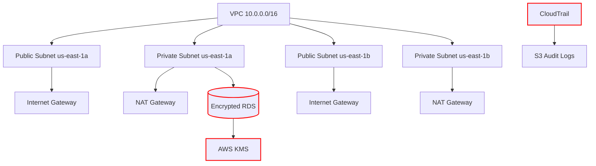

# HIPAA-Compliant VPC Architecture

## Core Infrastructure Design


## HIPAA Security Controls
| **Component**       | **HIPAA Requirement**     | **Implementation**                     |
|----------------------|---------------------------|----------------------------------------|
| RDS Database         | §164.312(a)(1)            | AES-256 encryption via KMS             |
| VPC Flow Logs        | §164.312(b)               | Enabled with 90-day retention          |
| Security Groups      | §164.312(c)(1)            | Port 5432 access only from private subnets |
| IAM Policies         | §164.312(a)(2)(i)         | Least privilege DB access              |
| Backup Systems       | §164.308(a)(7)(ii)(A)     | 35-day automated snapshots             |

## Network Specifications
| **Resource Type**   | **us-east-1a**       | **us-east-1b**       |
|----------------------|----------------------|----------------------|
| **Public Subnet**    | 10.0.101.0/24        | 10.0.102.0/24        |
| **Private Subnet**   | 10.0.1.0/24          | 10.0.2.0/24          |
| **Route Table**      | Public → IGW         | Private → NAT Gateway|

## Cost Optimization


## Deployment Commands
```bash
# Initialize Terraform
terraform init

# Deploy infrastructure
terraform apply -var="db_password=SECURE_PASSWORD"

# Verify encryption
aws rds describe-db-instances \
  --query 'DBInstances[*].{DB:DBInstanceIdentifier, Encrypted:StorageEncrypted}'
```
